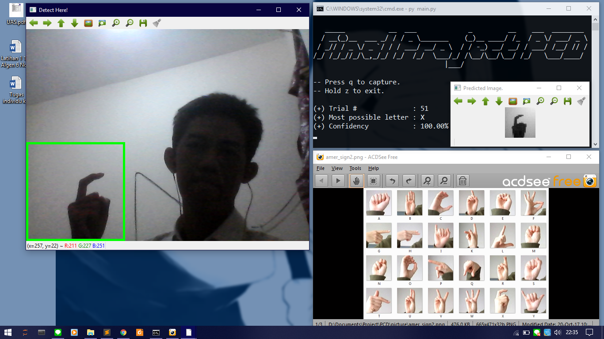

# Final-Project-PCD

A simple detector to predict letters from sign language using webcam.

## Pre-words
This project is done in accomplishment of final project of PCD lecture in Universitas Gadjah Mada. PCD stands for Pengolahan Citra Digital in Bahasa Indonesia, which translated to Digital Image Processing (DIP) in English. This project use Convolutional Neural Network as a prediction model used to predict what letter the input image is, and use OpenCV library to open webcam and handle digital image processing techniques.

## 1. How to use
This project use command-line to run. All you need just webcam, Python 3, and some of libraries installed. Download this repo first.
1.  Open command line
2.  In the command line, change directory to where this repo is in. If this repo is in **C:\Users\Rimba\Downloads**, to change the directory you can type `cd C:\Users\Rimba\Downloads\Final-Project-PCD` in command line.
3.  Run `main.py` using Python command. You can type `py main.py` or `python3 main.py` in command line to run.
4.  Wait the program until it finished importing library and loading model. Webcam window will appear after it finished.
5.  Try one of sign language letter in `amer_sign2.png` file. Use your right hand, and place it in green box on the webcam window.
6.  Press `q` button to capture. Predicted image and its result will appear in command line. Hold `z` button to exit. Make sure the webcam window is your active window while pressing these buttons.

## 2. Libraries installed
1.  <a href="http://www.numpy.org/">NumPy</a>. Image will be treated as 2D matrix with 3 layers (red, green, and blue). Numpy is most used library to handle this.
2.  <a href="https://docs.opencv.org/3.0-beta/doc/py_tutorials/py_tutorials.html">OpenCV</a> for Python 3. Used for showing webcam and do some digital image processing (DIP) techniques.
3.  <a href="https://keras.io/">Keras</a>. Used to load prediciton model and predict letter from image given.

Installing using conda is more recommended than using `pip install` for a <a href="https://stackoverflow.com/questions/29499815/how-to-install-numpy-on-windows-using-pip-install">reason</a>. Type these commands to install the library.
1.  `conda install -c anaconda numpy`
2.  `conda install -c conda-forge opencv`
3.  `conda install -c conda-forge keras`

To import NumPy, OpenCV, or Keras, use `import numpy`, `import cv2`, or `import keras` respectively.

## 3. How it works
The program works as follows:
1.  Importing library, loading model, and open the webcam with green box on the bottom left
2.  Crop 224x224 pixel image in the box and use it as input image
3.  If `q` is pressed, input image will go through these techniques consecutively:
- Contrast stretching. This will stretch pixel intensity of the image to a range of [a, b]
- Grayscaling. For each pixel of the image, its intensity replaced with mean of its R, G, and B intensity value.
- Downsampling. The prediction model only accept 28x28 pixel of input image, then the input image should be resized (downsampled) using certain interpolation method. Default method used is linear interpolation.
4.  The prediction model will predict what letter is the input image.
5.  Else, if `z` is pressed, the program will closing webcam window and exit.

## 4. Features
Some of additional feature in this project beside predicting letters:
1.  If you type `py main.py mine` in command line instead of only `py main.py`, every number of trials which multiple of 5, the webcam will capture the original image and save it to folder `mined\big`. It always save the downsampled input image (the 28x28 px grayscale image) in `mined\small` even if the command used is only `py main.py`. This mined image can be used for some purpose such as generate data training and test the model on big image containing some hands. Saved image has name format of `DD-MM-YY HH-MM-SS.JPG`.

## 5. Weaknesses
This project still have some sort of weaknesses that can be repaired soon:
1.  Bad prediction performance if the background behind the hand is not bright/white. This is the biggest weakness in this project I think. The solution to handle this weakness is maybe do some background substracting technique.
2.  Only good at predicting some letters even though if the background is bright. This project mostly successful in predicting C, F, L, O, V, W, and X. The letters A, B, E, I, K, M, N, P, Q, S, or U are so rarely predicted as correct. Letter J and Z can not be predicted since a person have to make a motion with their hand to sign it. The remaining letters have average correct prediction but not as good as the first seven letters. This weakness can be repaired by using different model.
3.  DIP techniques used are just too few, and the ConvNet model is too vanilla. I use the kernel <a href="https://www.kaggle.com/ranjeetjain3/deep-learning-using-sign-langugage">here</a> to create the model. Supposed to use more advanced DIP techniques and neural network configurations.
4.  Only predict when triggered by `q` button. It could predict in stream using sliding window technique only if the prediction model is good enough.
